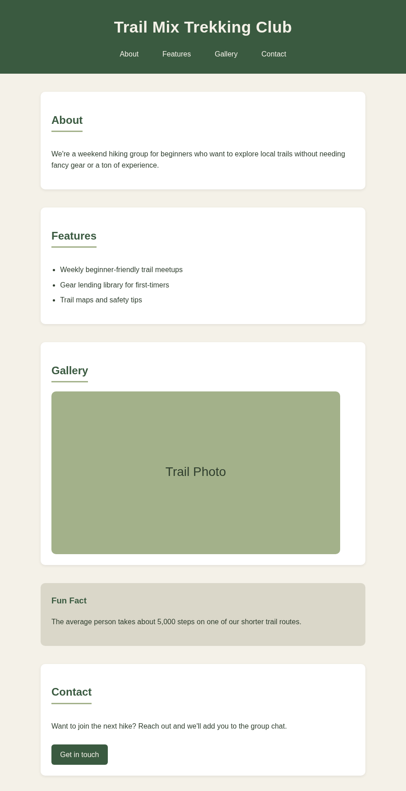

# Style It Yourself — Practical Task

This is a plain HTML page with no design yet, exactly like your website looked right before Week 2. Your job is to use what you learned about CSS to make it look like a real product.

## What you're aiming for

Here's one example of a finished page, built from this exact starter structure:

This is just **one** possible result a different color palette, fonts, or spacing would be just as valid. Use it to gauge the level of polish and structure you're aiming for (readable, spaced out, has a clear layout), not the specific colors or style. Your finished page should look and feel like your own project idea, not a copy of this one.

## Getting started

1. Open the folder in your codespace.
2. Open `index.html` in your browser to see the current, unstyled page.
3. Open `css/style.css`: this is where all your styling will go. It's already linked to `index.html`, so anything you write here will show up when you refresh the page.

## Your task

Rewrite the content in `index.html` for a project idea of your own (a game, a hobby, a sport, anything you like) — same structure, your words. Then style it in `css/style.css`. Your finished page must include:

- [ ] A background color for the page (`body`)
- [ ] A text color that isn't the default black
- [ ] A styled heading (`h1`) — change its color, size, or alignment
- [ ] Styled paragraph text — check `line-height` makes it easy to read
- [ ] A styled navigation bar (`nav`) so the links don't just look like plain blue text
- [ ] Spacing around your sections so nothing feels crowded (`margin` and/or `padding`)
- [ ] At least one element styled using a **class** selector (for example, give a section `class="card"` and style `.card` in your CSS)
- [ ] A real image in the gallery section, with a meaningful `alt` description

## Stretch goals (optional)

Only attempt these once everything above is done:

- Give your `<a>` links a hover effect using `:hover`
- Round the corners of a card or button with `border-radius`
- Arrange your nav links in a row using `display: flex` and `gap`

## Checking your own work

Before you call it done, ask yourself:

1. If a stranger saw this page for the first time, would they understand what it's about?
2. Does every image have `alt` text that actually describes it?
3. Is there enough contrast between your text color and your background color to read comfortably?
4. Did you use at least one class selector, not just element selectors?

## Submitting

Commit your changes with a clear message (for example `git commit -m "Style homepage with colors and spacing"`) and push to your GitHub repository, the same way you did in Week 1 and Week 2.
